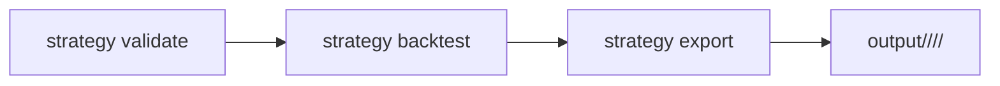

# Commands for `stacksats.strategies.model_example`

This file explains how to run checks, backtests, and exports using the packaged example strategy module:

- `stacksats.strategies.model_example`
- strategy class: `ExampleMVRVStrategy`

Strategy implementations can use either:
- `propose_weight(state)` for per-day intent, or
- `build_target_profile(ctx, features_df, signals)` for batch intent.

## Strategy Lifecycle Flow



## Prerequisites

From the repo root:

```bash
pip install -e .
```

Optional dependencies:

```bash
# For local development tools
pip install -r requirements-dev.txt

# For export and database tooling
pip install -e ".[deploy]"
```

## Strategy Spec Format

CLI commands that load a strategy use:

```text
module_or_path:ClassName
```

For this example module:

```text
stacksats.strategies.model_example:ExampleMVRVStrategy
```

## 1) Quick Run (inside `stacksats.strategies.model_example`)

Run the file directly:

```bash
python -m stacksats.strategies.model_example
```

With custom options:

```bash
python -m stacksats.strategies.model_example \
  --start-date 2020-01-01 \
  --end-date 2025-01-01 \
  --output-dir output \
  --strategy-label example-mvrv-strategy
```

What this does:
- Runs `strategy.validate(...)`
- Runs `strategy.backtest(...)`
- Writes plots + JSON output under `output/<strategy_id>/<version>/<run_id>/`

## 2) Validate Strategy via Strategy Lifecycle CLI

Check whether the model passes package validation gates:

```bash
stacksats strategy validate \
  --strategy stacksats.strategies.model_example:ExampleMVRVStrategy \
  --min-win-rate 25.0
```

Common options:

```bash
stacksats strategy validate \
  --strategy stacksats.strategies.model_example:ExampleMVRVStrategy \
  --strategy-config strategy_config.json \
  --start-date 2020-01-01 \
  --end-date 2025-01-01 \
  --strict \
  --min-win-rate 25.0
```

`--strict` enables additional robustness gates (determinism, mutation, leakage, OOS fold checks, and shuffled baseline checks).
Default `--min-win-rate` is `50.0`; use it when you explicitly want the stricter default gate.

## 3) Run Full Backtest via Strategy Lifecycle CLI

Basic:

```bash
stacksats strategy backtest --strategy stacksats.strategies.model_example:ExampleMVRVStrategy
```

With options:

```bash
stacksats strategy backtest \
  --strategy stacksats.strategies.model_example:ExampleMVRVStrategy \
  --strategy-config strategy_config.json \
  --start-date 2020-01-01 \
  --end-date 2025-01-01 \
  --output-dir output \
  --strategy-label model-example
```

## 4) Export Strategy Artifacts

```bash
stacksats strategy export \
  --strategy stacksats.strategies.model_example:ExampleMVRVStrategy \
  --strategy-config strategy_config.json \
  --start-date 2025-12-01 \
  --end-date 2027-12-31 \
  --output-dir output
```

Artifacts are written under:

```text
output/<strategy_id>/<version>/<run_id>/
```

This includes:
- `weights.csv`
- `timeseries_schema.md`
- `artifacts.json` (`strategy_id`, `version`, `config_hash`, `run_id`, file map)
- canonical `weights.csv` columns: `start_date`, `end_date`, `day_index`, `date`, `price_usd`, `weight`

Notes:
- `stacksats strategy export` is strategy artifact export (filesystem output).
- `--start-date` and `--end-date` are required for `stacksats strategy export`.

## 5) Useful Development Commands

Verify this document's example commands end-to-end:

```bash
# Requires ./venv (for example: python -m venv venv && source venv/bin/activate && pip install -e .)
python scripts/test_example_commands.py
```

Run tests:

```bash
pytest tests/ -v
```

Run lint:

```bash
ruff check .
```

## Troubleshooting

- **`Invalid strategy spec`**
  Ensure format is exactly `module_or_path:ClassName`.

- **`Class 'ExampleMVRVStrategy' not found`**
  Check class name spelling and module path.

- **`Strategy file not found`**
  Use a module spec (recommended) or run from repo root when using a file path.
