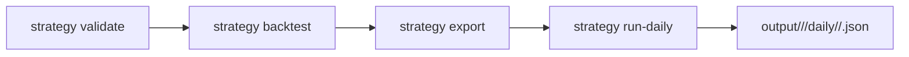

# Commands for `stacksats.strategies.examples:SimpleZScoreStrategy`

This is the canonical source for lifecycle CLI usage.

- module: `stacksats.strategies.examples`
- strategy class: `SimpleZScoreStrategy`

Strategy implementations can use either:

- `propose_weight(state)` for per-day intent, or
- `build_target_profile(ctx, features_df, signals)` for batch intent.

## Most Common Commands (copy/paste)

```bash
# Validate
stacksats strategy validate \
  --strategy stacksats.strategies.examples:SimpleZScoreStrategy \
  --start-date 2024-01-01 \
  --end-date 2024-12-31

# Backtest
stacksats strategy backtest \
  --strategy stacksats.strategies.examples:SimpleZScoreStrategy \
  --start-date 2024-01-01 \
  --end-date 2024-12-31 \
  --output-dir output

# Export (explicit date bounds required)
stacksats strategy export \
  --strategy stacksats.strategies.examples:SimpleZScoreStrategy \
  --start-date 2024-01-01 \
  --end-date 2024-12-31 \
  --output-dir output

# Run daily execution (paper mode by default)
stacksats strategy run-daily \
  --strategy stacksats.strategies.examples:SimpleZScoreStrategy \
  --total-window-budget-usd 1000 \
  --mode paper
```

Expected output location for backtest/export artifacts:

```text
output/<strategy_id>/<version>/<run_id>/
```

## Strategy Lifecycle Flow


```mermaid
flowchart LR
    A["strategy validate"] --> B["strategy backtest"]
    B --> C["strategy export"]
    C --> D["strategy run-daily"]
    D --> E["output/<strategy_id>/<version>/daily/<run_date>/<run_key>.json"]
```

## Prerequisites

From the repo root:

```bash
python -m venv venv
source venv/bin/activate
venv/bin/python -m pip install --upgrade pip
venv/bin/python -m pip install -e ".[dev]"
```

Optional dependencies:

```bash
# For export and database tooling
venv/bin/python -m pip install -e ".[deploy]"
```

Data source contract:
- Strategy runtime is BRK-only (`STACKSATS_ANALYTICS_DUCKDB` -> `./bitcoin_analytics.duckdb` fallback).
- Legacy source compatibility paths are not supported in `0.7.x`.
- For DuckDB fetch/manual placement/checksum workflow, use [BRK Data Source](data-source.md).

## Strategy Spec Format

CLI commands that load a strategy use:

```text
module_or_path:ClassName
```

For this example module:

```text
stacksats.strategies.examples:SimpleZScoreStrategy
```

## 1) Quick Run (via lifecycle CLI)

Run a fast validation:

```bash
stacksats strategy validate \
  --strategy stacksats.strategies.examples:SimpleZScoreStrategy \
  --start-date 2024-01-01 \
  --end-date 2024-12-31
```

Then run a backtest:

```bash
stacksats strategy backtest \
  --strategy stacksats.strategies.examples:SimpleZScoreStrategy \
  --start-date 2024-01-01 \
  --end-date 2024-12-31 \
  --output-dir output \
  --strategy-label simple-zscore
```

What this does:

- Runs the canonical strategy lifecycle without relying on legacy module entry points.
- Writes plots + JSON output under `output/<strategy_id>/<version>/<run_id>/`

## 2) Validate Strategy via Strategy Lifecycle CLI

Check whether the model passes package validation gates:

```bash
stacksats strategy validate \
  --strategy stacksats.strategies.examples:SimpleZScoreStrategy \
  --start-date 2024-01-01 \
  --end-date 2024-12-31 \
  --min-win-rate 25.0
```

Common options:

```bash
stacksats strategy validate \
  --strategy stacksats.strategies.examples:SimpleZScoreStrategy \
  --strategy-config strategy_config.json \
  --start-date 2024-01-01 \
  --end-date 2024-12-31 \
  --no-strict \
  --min-win-rate 25.0
```

Expected output:

- Terminal summary like `Validation PASSED | ...`.
- Win-rate threshold status and leakage/constraint checks.

`stacksats strategy validate` runs in strict mode by default. Use `--no-strict` only when you intentionally want the lighter validation path.
Strict mode includes additional robustness gates (determinism, mutation, leakage, OOS fold checks, and shuffled baseline checks).
Default `--min-win-rate` is `50.0`; use it when you explicitly want the stricter default gate.

## 3) Run Full Backtest via Strategy Lifecycle CLI

Basic:

```bash
stacksats strategy backtest \
  --strategy stacksats.strategies.examples:SimpleZScoreStrategy \
  --start-date 2024-01-01 \
  --end-date 2024-12-31
```

With options:

```bash
stacksats strategy backtest \
  --strategy stacksats.strategies.examples:SimpleZScoreStrategy \
  --strategy-config strategy_config.json \
  --start-date 2024-01-01 \
  --end-date 2024-12-31 \
  --output-dir output \
  --strategy-label simple-zscore
```

Expected output:

- `backtest_result.json`
- `metrics.json`
- plot `.svg` files

All under `output/<strategy_id>/<version>/<run_id>/`.

## 4) Export Strategy Artifacts

```bash
stacksats strategy export \
  --strategy stacksats.strategies.examples:SimpleZScoreStrategy \
  --strategy-config strategy_config.json \
  --start-date 2024-01-01 \
  --end-date 2024-12-31 \
  --output-dir output
```

Artifacts are written under:

```text
output/<strategy_id>/<version>/<run_id>/
```

This includes:

- `weights.csv`
- `timeseries_schema.md`
- `artifacts.json` (`strategy_id`, `version`, `config_hash`, `run_id`, file map)
- canonical `weights.csv` columns: `start_date`, `end_date`, `day_index`, `date`, `price_usd`, `weight`

Notes:

- `stacksats strategy export` is strategy artifact export (filesystem output).
- `--start-date` and `--end-date` are required for `stacksats strategy export`.
- exported windows are validated against the exact daily range between `start_date` and `end_date`.
- you can reconstruct the batch object later with `StrategyTimeSeriesBatch.from_artifact_dir(...)`.

## 5) Run Idempotent Daily Execution

Paper execution:

```bash
stacksats strategy run-daily \
  --strategy stacksats.strategies.examples:SimpleZScoreStrategy \
  --total-window-budget-usd 1000 \
  --mode paper
```

Live adapter interface (bring your own adapter class):

```bash
stacksats strategy run-daily \
  --strategy stacksats.strategies.examples:SimpleZScoreStrategy \
  --total-window-budget-usd 1000 \
  --mode live \
  --adapter my_broker_adapter.py:MyBrokerAdapter
```

Defaults and behavior:

- `--state-db-path` defaults to `.stacksats/run_state.sqlite3`.
- rerunning the same strategy/date/mode/config is a no-op unless `--force` is set.
- order notional formula: `weight_today * total_window_budget_usd`.

Expected status lines:

- `Status: EXECUTED`
- `Status: NO-OP (idempotent)`
- `Status: FAILED`

## 6) Useful Development Commands

Verify this document's example commands end-to-end:

```bash
# Runs deterministic smoke variants of the commands on this page.
# Requires ./venv (for example: python -m venv venv && source venv/bin/activate && pip install -e ".[dev]")
venv/bin/python scripts/test_example_commands.py
```

Run tests:

```bash
venv/bin/python -m pytest -q
venv/bin/python -m pytest -m "slow or integration or performance" -q
```

Run lint:

```bash
venv/bin/python -m ruff check .
```

## 7) DuckDB Factor Research Commands

DuckDB provider runtime path resolution:

- first choice: `STACKSATS_ANALYTICS_DUCKDB`
- fallback: `./bitcoin_analytics.duckdb` (repo root)

Train and freeze the DuckDB artifact:

```bash
export STACKSATS_ANALYTICS_DUCKDB=./bitcoin_analytics.duckdb
venv/bin/python scripts/train_duckdb_factor_strategy.py \
  --start-date 2018-01-01 \
  --end-date 2025-05-31 \
  --output stacksats/strategies/duckdb_alpha_v1.json
```

Run baseline vs candidate comparison:

```bash
venv/bin/python scripts/compare_duckdb_alpha.py \
  --start-date 2018-01-01 \
  --end-date 2025-05-31
```

Fast research loop (candidate-only backtest, strict skipped, baseline overridden):

```bash
venv/bin/python scripts/compare_duckdb_alpha.py \
  --start-date 2018-01-01 \
  --end-date 2025-05-31 \
  --baseline-score 66.1640 \
  --baseline-win-rate 52.5597 \
  --baseline-exp-decay-percentile 79.7683 \
  --baseline-mean-dynamic-sats-per-dollar 7277.21 \
  --skip-strict
```

Promotion checklist for DuckDB alpha:

- Candidate score and win-rate improve over baseline on the same horizon.
- Strict validation is run at least once on the exact candidate/artifact snapshot.
- Artifact hash and comparison output are captured in PR notes.
- Any gate failure (permutation p-value, fold instability, or drift) is recorded with mitigation notes.

## Troubleshooting

- **`Invalid strategy spec`**
  Ensure format is exactly `module_or_path:ClassName`.

- **`Class 'SimpleZScoreStrategy' not found`**
  Check class name spelling and module path.

- **`Strategy file not found`**
  Use a module spec (recommended) or run from repo root when using a file path.

- **Export failed due to missing date bounds**
  Provide both `--start-date` and `--end-date`.

- **Export failed due to data coverage**
  Use an `--end-date` that is covered by available source data.

- **Live mode failed with adapter error**
  Ensure `--adapter module_or_path:ClassName` is provided and returns `DailyOrderReceipt`.

## Feedback

- [Was this page helpful? Open docs feedback issue](https://github.com/hypertrial/stacksats/issues/new?template=docs_feedback.md&title=%5Bdocs%5D+Feedback%3A+CLI+Commands)
