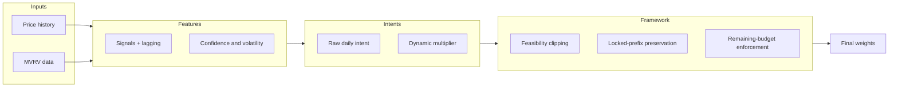

# Model Overview

This page is the top-level map of the StackSats model.

The model computes daily DCA weights using MVRV and trend context while the framework enforces invariants (`sum == 1.0`, feasibility clipping, and lock semantics).

## Reading Path

1. [Signals and Features](concepts/model-signals-features.md)
2. [Allocation Kernel](concepts/allocation-kernel.md)
3. [Backtest Runtime](model_backtest.md)

## Model Architecture

## Core properties

- Deterministic output for identical inputs.
- Historical allocations are immutable once locked.
- Future allocations are feasibility-aware and budget-constrained.

## Related references

- [Framework Boundary](framework.md)
- [Runtime Objects Overview](objects.md)
- [API Reference](reference/api/index.md)
