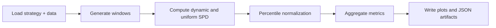

# Bitcoin DCA Backtest System

This document explains how StackSats runs strategy backtests and how to interpret the output metrics.

## Overview

The backtest compares a strategy against uniform DCA (equal daily allocations) across rolling fixed-span windows.

Default behavior:
- Fixed allocation span: configured globally (`STACKSATS_ALLOCATION_SPAN_DAYS`, default `365`)
- Default start: `2018-01-01`
- Default end: dynamic "yesterday" (`get_backtest_end()`), unless overridden

Allocation invariants and the framework/user boundary are defined in `docs/framework.md`.

## Backtest Pipeline



## Runtime Path

Backtesting is orchestrated through these modules:

1. `stacksats/runner.py`
   - `StrategyRunner.backtest(...)` is the canonical entry point.
   - Validates strategy contract, builds `StrategyContext`, computes per-window weights, and enforces weight constraints.
2. `stacksats/prelude.py`
   - `compute_cycle_spd(...)` builds rolling windows and computes sats-per-dollar metrics.
   - `backtest_dynamic_dca(...)` aggregates window-level results and computes the exponential-decay percentile.
3. `stacksats/model_development.py`
   - `precompute_features(...)` computes lagged model features used by strategy hooks.
4. `stacksats/api.py`
   - `BacktestResult` exposes summaries, JSON export, and plotting helpers.

`stacksats/backtest.py` contains plotting/metrics visualization helpers used by `BacktestResult.plot(...)`.

## Core Metrics

Per rolling window, StackSats computes:

```python
inv_price = 1e8 / price_slice
uniform_spd = inv_price.mean()
dynamic_spd = (weights * inv_price).sum()
```

Then normalizes each window to percentile space:

```text
percentile = (spd - min_spd) / (max_spd - min_spd) * 100
```

Primary aggregated metrics:
- `win_rate`: percentage of windows where `dynamic_percentile > uniform_percentile`
- `exp_decay_percentile`: recency-weighted mean dynamic percentile
- `score`: `0.5 * win_rate + 0.5 * exp_decay_percentile`

## Validation Behavior

Validation (`StrategyRunner.validate`) runs a backtest and additional gates:

- Forward-leakage probes (masked/perturbed future invariance)
- Weight constraint enforcement (sum/range checks)
- Win-rate threshold check (`min_win_rate`, default `50.0`)
- Optional strict checks (`strict=True`):
  - determinism
  - in-place mutation detection
  - boundary-hit saturation diagnostics
  - locked-prefix immutability
  - fold robustness checks
  - shuffled-price null checks

Validation summary output includes the configured threshold (not just the default):

```text
Validation PASSED | Forward Leakage: True | Weight Constraints: True | Win Rate: 62.40% (>=50.00%: True)
```

## Output Artifacts

### Backtest CLI (`stacksats strategy backtest`)

Writes run artifacts under:

```text
<output_dir>/<strategy_id>/<version>/<run_id>/
```

Includes:
- backtest plots (`*.svg`)
- `metrics.json`
- `backtest_result.json`

### Export CLI (`stacksats strategy export`)

Writes run artifacts under:

```text
<output_dir>/<strategy_id>/<version>/<run_id>/
```

Includes:
- `weights.csv`
- `timeseries_schema.md`
- canonical columns: `start_date`, `end_date`, `day_index`, `date`, `price_usd`, `weight`
- `artifacts.json` (strategy metadata + file map)

## Usage

Run a backtest from CLI:

```bash
stacksats strategy backtest \
  --strategy examples/model_example.py:ExampleMVRVStrategy \
  --start-date 2020-01-01 \
  --end-date 2025-01-01 \
  --output-dir output \
  --strategy-label model-example
```

Run from Python:

```python
from examples.model_example import ExampleMVRVStrategy
from stacksats import BacktestConfig, ValidationConfig

strategy = ExampleMVRVStrategy()

validation = strategy.validate(
    ValidationConfig(
        start_date="2020-01-01",
        end_date="2025-01-01",
        min_win_rate=50.0,
        strict=True,
    )
)
print(validation.summary())

result = strategy.backtest(
    BacktestConfig(
        start_date="2020-01-01",
        end_date="2025-01-01",
        strategy_label="model-example",
    )
)
print(result.summary())
result.plot(output_dir="output")
result.to_json("output/backtest_result.json")
```

## Interpretation Notes

- Exact performance numbers vary with date range and refreshed source data.
- Comparing strategies should use the same start/end range and allocation span.
- Strict-mode diagnostics are intended to catch leakage/overfitting patterns that simple win-rate checks can miss.
