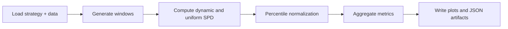

# Bitcoin Dollar Cost Averaging (DCA) Backtest System

This document explains how StackSats tests whether a dynamic Bitcoin DCA allocation robustly acquires more BTC than uniform DCA for the same fixed budget and allocation horizon, and how to interpret the output metrics.

## Overview

The backtest compares a strategy against uniform DCA (equal daily allocations) across rolling fixed-span windows.

Default behavior:
- Fixed allocation span: configured globally (`STACKSATS_ALLOCATION_SPAN_DAYS`, default `365`)
- Default start: `2018-01-01`
- Default end: fixed `2025-12-31` (`get_backtest_end()`), unless overridden
- Feature materialization includes pre-start history by default for warmup; scoring windows still start at `start_date`.

Allocation invariants and the framework/user boundary are defined in `docs/framework.md`.

## Backtest Pipeline


```mermaid
flowchart LR
    A["Load strategy + data"] --> B["Generate windows"]
    B --> C["Compute dynamic and uniform SPD"]
    C --> D["Percentile normalization"]
    D --> E["Aggregate metrics"]
    E --> F["Write plots and JSON artifacts"]
```

## Runtime Path

Backtesting is orchestrated through these modules:

1. `stacksats/runner/__init__.py`
   - `StrategyRunner.backtest(...)` is the canonical entry point.
   - Validates strategy contract, builds `StrategyContext`, computes per-window weights, and enforces weight constraints.
2. `stacksats/data/prelude.py`
   - `load_data(...)` delegates to `BTCDataProvider` with strict source-only runtime BRK parquet validation (no synthetic fill behavior). Runtime ingestion is lazy-first (`scan_parquet`) but `load_data(...)` collects and returns an eager `pl.DataFrame`. Runtime resolution follows `STACKSATS_ANALYTICS_PARQUET`, managed default `~/.stacksats/data/bitcoin_analytics.parquet`, then legacy local fallback `./bitcoin_analytics.parquet`. Canonical source dataset remains long-format `merged_metrics*.parquet` (see [Merged Metrics Parquet Schema](reference/merged-metrics-parquet-schema.md)).
   - `compute_cycle_spd(...)` builds rolling windows and computes sats-per-dollar metrics.
   - For runner-owned profile strategies, the backtest path uses an internal Polars-first fast lane: window bounds, inverse-price metrics, and fixed-window scalars are precomputed in batch, while arbitrary callables still use the generic per-window fallback.
   - `backtest_dynamic_dca(...)` aggregates window-level results and computes the exponential-decay percentile.
3. `stacksats/model_development/` (package; public facade in `__init__.py`)
   - `precompute_features(...)` computes the built-in lagged model feature set as an eager `pl.DataFrame`.
   - Framework-owned feature providers compose lazy feature pipelines internally, join them in the registry, and collect once before strategy hooks receive `ctx.features_df`.
   - Allocation prep is Polars-first through the calendar/profile alignment stage. The only intentional NumPy boundary in the hot path is the sealed sequential allocation kernel.
4. `stacksats/api/__init__.py`
   - `BacktestResult` exposes summaries, JSON export, and plotting helpers.

`stacksats/backtest/__init__.py` contains plotting/metrics visualization helpers used by `BacktestResult.plot(...)`.

## Migration Notes

If you maintained custom tooling around older backtest internals:

- Removed: `compute_weights_shared(window_feat)`.
  - Use: `compute_weights_with_features(window_feat, features_df=...)`.
- `get_backtest_end()` returns the canonical default scoring horizon (`2025-12-31`).
- Updated signature: `generate_date_ranges(start, end, min_length_days)` -> `generate_date_ranges(start, end)`.

Internal helper modules are not part of the stable public API. Prefer `StrategyRunner`, top-level `stacksats` exports, and CLI commands for long-term integrations.

## Core Metrics

Per rolling window, StackSats computes:

```python
inv_price = 1e8 / price_slice
uniform_spd = inv_price.mean()
dynamic_spd = (weights * inv_price).sum()
```

Then normalizes each window to percentile space:

```text
percentile = (spd - min_spd) / (max_spd - min_spd) * 100
```

Primary aggregated metrics:
- `win_rate`: percentage of windows where `dynamic_percentile > uniform_percentile`
- `exp_decay_percentile`: recency-weighted mean dynamic percentile
- `score`: `0.5 * win_rate + 0.5 * exp_decay_percentile`

## Why Sats per Dollar (SPD)? vs ROI/CAGR

Financial analysts often look for **Return on Investment (ROI)** or **Compound Annual Growth Rate (CAGR)** to evaluate performance. However, for a pure accumulation strategy, these metrics can be misleading.

### Accumulation Efficiency vs. Portfolio Value

- **ROI/CAGR** measures how much your *portfolio value (in USD)* has grown. This is heavily dependent on the market price of Bitcoin at the start and end of the period.
    - *Example:* If Bitcoin price doubles, your ROI doubles, even if your strategy did nothing special.
- **Sats per Dollar (SPD)** measures your *accumulation efficiency*. It asks: "For every dollar I spent, how much Bitcoin did I get?"
    - *Formula:* $\text{Total Sats Accumulated} / \text{Total USD Invested}$
    - *Goal:* In an accumulation strategy, you want to acquire *more* Bitcoin than a simple daily purchase (uniform DCA) would have yielded for the same cost.

### The Analyst's Edge

By maximizing SPD, you are mathematically minimizing your average cost basis. This gives you an "edge" over the market price.
- **High SPD** = You bought more when price was low (relative to value).
- **Low SPD** = You bought more when price was high.

A strategy with high SPD will *always* outperform a strategy with low SPD in terms of total Bitcoin holdings, regardless of where the price goes next. This makes it the only controllable metric for long-term conviction holders.

## Validation Behavior

Validation (`StrategyRunner.validate`) runs a backtest and additional gates:

- Forward-leakage probes (masked/perturbed future invariance)
- Weight constraint enforcement (sum/range checks)
- Win-rate threshold check (`min_win_rate`, default `50.0`)
- Optional strict checks (`strict=True`):
  - determinism
  - in-place mutation detection
  - boundary-hit saturation diagnostics
  - locked-prefix immutability
  - fold robustness checks
  - shuffled-price null checks

Validation summary output includes the configured threshold (not just the default):

```text
Validation PASSED | No Forward Leakage: True | Weight Constraints: True | Win Rate: 62.40% (>=50.00%: True)
```

## Output Artifacts

### Backtest CLI (`stacksats strategy backtest`)

Writes run artifacts under:

```text
<output_dir>/<strategy_id>/<version>/<run_id>/
```

Includes:
- backtest plots (`*.svg`)
- `metrics.json`
- `backtest_result.json`

### Export CLI (`stacksats strategy export`)

Writes run artifacts under:

```text
<output_dir>/<strategy_id>/<version>/<run_id>/
```

Includes:
- `weights.csv`
- `timeseries_schema.md`
- canonical columns: `start_date`, `end_date`, `day_index`, `date`, `price_usd`, `weight`
- `artifacts.json` (strategy metadata + file map)

## Artifact Previews

Example `metrics.json` (truncated shape):

```json
{
  "schema_version": "1.0.0",
  "timestamp": "2026-03-27T09:30:00.000000",
  "summary_metrics": {
    "win_rate": 62.4,
    "exp_decay_percentile": 58.1,
    "score": 60.25,
    "exp_decay_multiple_vs_uniform": 1.043
  },
  "window_level_data": [
    {
      "window": "2024-01-01 → 2024-12-31",
      "start_date": "2024-01-01T00:00:00",
      "dynamic_percentile": 58.7,
      "uniform_percentile": 56.1,
      "excess_percentile": 2.6
    }
  ]
}
```

Example `weights.csv` header + row:

```csv
start_date,end_date,day_index,date,price_usd,weight
2025-12-01,2026-11-30,0,2025-12-01,96250.12,0.0027397260
```

Example `backtest_result.json` (truncated shape):

```json
{
  "schema_version": "1.0.0",
  "provenance": {
    "strategy_id": "simple-zscore",
    "version": "1.0.0",
    "config_hash": "abc123",
    "run_id": "run-001"
  },
  "summary_metrics": {
    "score": 60.25,
    "win_rate": 62.4,
    "exp_decay_percentile": 58.1,
    "uniform_exp_decay_percentile": 55.8,
    "exp_decay_multiple_vs_uniform": 1.041,
    "windows": 12
  },
  "window_level_data": [
    {
      "window": "2024-01-01 → 2024-12-31",
      "dynamic_percentile": 58.7,
      "uniform_percentile": 56.1,
      "excess_percentile": 2.6
    }
  ]
}
```

Example `artifacts.json` (truncated shape):

```json
{
  "schema_version": "1.0.0",
  "strategy_id": "simple-zscore",
  "version": "1.0.0",
  "config_hash": "abc123",
  "run_id": "run-001",
  "output_dir": "/abs/path/output/simple-zscore/1.0.0/run-001",
  "files": {
    "weights_csv": "weights.csv",
    "timeseries_schema_md": "timeseries_schema.md"
  }
}
```

## Usage

Run a backtest from CLI:

```bash
stacksats data fetch
stacksats data prepare
stacksats strategy backtest \
  --strategy simple-zscore \
  --start-date 2024-01-01 \
  --end-date 2024-12-31 \
  --output-dir output \
  --strategy-label simple-zscore
```

Run from Python:

```python
from stacksats.strategies.examples import SimpleZScoreStrategy
from stacksats import BacktestConfig, ValidationConfig

strategy = SimpleZScoreStrategy()

validation = strategy.validate(
    ValidationConfig(
        start_date="2024-01-01",
        end_date="2024-12-31",
        min_win_rate=50.0,
        strict=True,
    )
)
print(validation.summary())

result = strategy.backtest(
    BacktestConfig(
        start_date="2024-01-01",
        end_date="2024-12-31",
        strategy_label="simple-zscore",
    )
)
print(result.summary())
result.plot(output_dir="output")
result.to_json("output/backtest_result.json")
```

## Interpretation Notes

- Exact performance numbers vary with date range and refreshed source data.
- Comparing strategies should use the same start/end range and allocation span.
- Strict-mode diagnostics are intended to catch leakage/overfitting patterns that simple win-rate checks can miss.

## Feedback

- [Was this page helpful? Open docs feedback issue](https://github.com/hypertrial/stacksats/issues/new?template=docs_feedback.md&title=%5Bdocs%5D+Feedback%3A+Backtest+Runtime)
