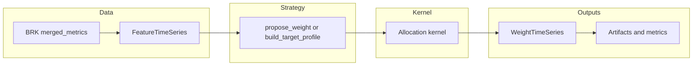

# System Overview

Use this page when you need a **single mental model** before diving into the framework contract and command reference.

StackSats loads canonical Bitcoin analytics (BRK `merged_metrics*.parquet`), builds **FeatureTimeSeries** inputs, runs your **Strategy** hooks (daily intent or window-level intent), and applies the same **allocation kernel** everywhere: backtests, exports, `decide-daily`, and `run-daily`. The sealed kernel turns intent into **WeightTimeSeries** outcomes and on-disk artifacts. For the split between framework-owned mechanics and user-owned logic, see [Framework Boundary](../framework.md).

## Data and execution flow

## Production paths

- **Agent-native:** `stacksats strategy decide-daily` or `strategy.decide_daily(...)` emits a validated decision payload for an external agent; optionally expose the same flow over HTTP with [Agent API Service](../run/agent-api.md).
- **Integrated:** `stacksats strategy run-daily` runs the decision path and can submit through a configured adapter when you want StackSats to drive execution.

Task-first routing: [Task Hub](../tasks.md). Dataset and paths: [BRK Data Source](../data-source.md). Object summaries: [Runtime Objects Overview](../objects.md).

## Feedback

- [Was this page helpful? Open docs feedback issue](https://github.com/hypertrial/stacksats/issues/new?template=docs_feedback.md&title=%5Bdocs%5D+Feedback%3A+System+Overview)
