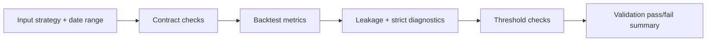

# Strategy Validation Properties (Exhaustive)

This is the canonical running list of properties that validation enforces for strategies.

Framework contract reference: `docs/framework.md`

## Validation Execution Flow

## Validation Property Checklist

1. [ ] **Allocation span config is valid**
   - `STACKSATS_ALLOCATION_SPAN_DAYS` must be an integer in `[90, 1460]` (default `365`).

2. [ ] **Strategy cannot bypass framework orchestration**
   - Custom `compute_weights` overrides are rejected.

3. [ ] **Strategy must implement an allowed hook path**
   - At least one is required: `propose_weight(state)` or `build_target_profile(ctx, features_df, signals)`.

4. [ ] **Strategy feature sets must be registry-backed**
   - `required_feature_sets()` must resolve to registered framework-owned feature providers.
   - Strategy classes must not source external files, databases, or network data directly.

5. [ ] **AST lint blockers are not present**
   - Hard failures include negative `.shift(...)`, centered `.rolling(..., center=True)`, direct file I/O, direct DB access, and direct network access inside strategy methods.

6. [ ] **`transform_features` output type is valid**
   - Must return a pandas `DataFrame`.

7. [ ] **Observed-only feature context is enforced**
   - `ctx.features_df` only contains rows from `start_date` through `current_date`.
   - Strategy hooks never receive rows after `current_date`.

8. [ ] **`build_signals` output type is valid**
   - Must return `dict[str, pandas.Series]`.

9. [ ] **Signal and profile series shape/index contract holds**
   - Each series must be a pandas `Series`, with no duplicate index, ascending index, exact match to the observed window index.

10. [ ] **Signal and profile series numeric validity holds**
   - Series values must be finite numeric (no `NaN`, `inf`, or non-numeric coercion failures).

11. [ ] **`propose_weight` outputs are finite**
   - Every proposal must be finite numeric.

12. [ ] **Target profile mode is valid**
   - Only `preference` and `absolute` modes are allowed.

13. [ ] **Allocation index monotonicity holds for temporal counting**
   - Allocation index used for `n_past` must be monotonic increasing.

14. [ ] **Locked-prefix structural validity holds**
   - `locked_weights` must be 1D, finite, values in `[0, 1]`, and length `<= n_past`.

15. [ ] **Locked-prefix budget feasibility holds**
   - Running sum of locked weights must never exceed total budget `1.0`.

16. [ ] **Locked-prefix daily bounds hold on contract-length windows**
   - When window length equals configured span, locked values must be within `[1e-5, 0.1]`.

17. [ ] **Per-day clipping obeys future feasibility constraints**
   - For contract-length windows, daily clipping enforces both day bounds and future-budget feasibility.
   - Infeasible bounds must hard-fail.

18. [ ] **Output weight vector structure is valid**
   - Final weights must be 1D and finite.

19. [ ] **Output weight values are valid**
   - No negative weights; no values above `1.0` (within tolerance).

20. [ ] **Output weights sum exactly to budget (within tolerance)**
   - Final weight sum must be `1.0`.

21. [ ] **Contract-length day bounds hold on final weights**
   - For span-length windows, each day weight must be within `[1e-5, 0.1]`.

22. [ ] **Daily bounds are globally feasible for span length**
   - Span must satisfy feasibility: `n_days * min_daily_weight <= 1.0 <= n_days * max_daily_weight`.

23. [ ] **Historical lock immutability is enforced in strict checks**
   - Injected locked prefix must be preserved exactly when recomputing under perturbed future features.

24. [ ] **Forward-leakage resistance: truncated-source invariance**
   - Prefix outputs at probe date must match when source data is truncated at the probe date and rematerialized as-of that date.

25. [ ] **Forward-leakage resistance: perturbed-future invariance**
   - Prefix outputs at probe date must match when source data strictly after the probe date is strongly perturbed before rematerialization.

26. [ ] **Profile-only leakage resistance is enforced**
   - For profile-hook strategies (without propose hook), prefix profile values must be invariant under masked/perturbed future inputs.

27. [ ] **Strict mode forbids in-place feature mutation**
   - Strategy must not mutate `ctx.features_df` during weight computation.

28. [ ] **Strict mode forbids profile-build feature mutation**
   - Strategy must not mutate `ctx.features_df` during transform/signal/profile build path.

29. [ ] **Strict mode determinism holds**
   - Repeated runs with identical inputs must produce exactly matching weights (within `atol=1e-12`).

30. [ ] **Weight constraints hold across validation windows**
   - Validation windows must not violate sum, negativity, or (when applicable) min/max day bounds.

31. [ ] **Boundary saturation stays below strict threshold**
   - In strict mode, boundary-hit rate (days at `MIN` or `MAX`) must be `<= max_boundary_hit_rate` (default `0.85`).

32. [ ] **Purged fold robustness minimum is met in strict mode (when fold checks run)**
   - Minimum fold win rate must be `>= min_fold_win_rate` (default `20.0`).
   - Folds use a purged walk-forward split with an embargo equal to the allocation span.
   - Fold checks are skipped when there is insufficient date range for at least two valid folds.

33. [ ] **Purged fold instability is bounded in strict mode (when fold checks run)**
   - Fold win-rate standard deviation must be `<= max_fold_win_rate_std` (default `35.0`).
   - Fold checks are skipped when there is insufficient date range for at least two valid folds.

34. [ ] **Block-shuffled null robustness threshold is met in strict mode (when shuffled checks run)**
   - Mean win rate on block-shuffled price trials must be `<= max_shuffled_win_rate` (default `80.0`) across `shuffled_trials` (default `3`).
   - Shuffled checks are skipped when `PriceUSD_coinmetrics` is missing, the shuffled window is empty, or `shuffled_trials <= 0`.

35. [ ] **Bootstrap confidence interval threshold is met in strict mode**
   - Lower bootstrap CI for anchored excess must be `>= min_bootstrap_ci_lower_excess`.

36. [ ] **Block-permutation null threshold is met in strict mode**
   - Block-permutation p-value for anchored excess versus uniform baseline must be `<= max_permutation_pvalue`.

37. [ ] **Feature drift is bounded in strict mode**
   - Feature PSI must be `<= max_feature_psi`.
   - Feature KS statistic must be `<= max_feature_ks`.

38. [ ] **Global win-rate threshold is met**
   - Validation backtest win rate must be `>= min_win_rate` (default `50.0`).

39. [ ] **Daily paper/live execution is gated on strict validation**
   - `run_daily()` performs strict validation on the same strategy fingerprint and data snapshot before order submission.

40. [ ] **Validation receipts and run fingerprints are persisted**
   - Daily runs persist validation receipt IDs, source-data hashes, and observed feature snapshot hashes for reconciliation.

41. [ ] **Validation date range must contain data**
   - Empty requested validation range is an automatic validation failure.

42. [ ] **Backtest path must generate windows**
   - Validation relies on backtest windows; if none are generated, validation cannot pass.
